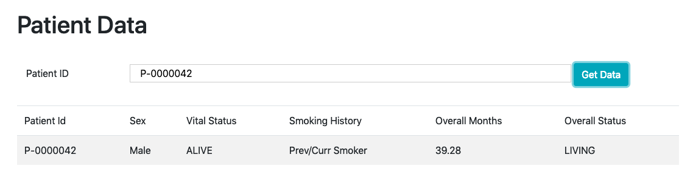

# Spark Demo Web Application

Spring Boot, Spark application that reads and writes to parquet developed for [cBioPortal Google Summer of Code project](https://github.com/cBioPortal/GSoC/issues/69).

## Running the application 

### Prerequisites

* [Java 8](https://www.java.com/en/download/help/download_options.xml)
* [Maven](https://maven.apache.org/install.html)
* [Spark](https://spark.apache.org/downloads.html)

### Modify application.properties

Modify spark.home to point to your spark install location.

###  Build and Start App

```
mvn clean package && java -jar target/demo-0.0.1-SNAPSHOT.war
```

Open the webpage at http://localhost:8080 



## API endpoints

GET methods:

* /api/writeParquet/{file} - Given filename.txt in data/ directory, writes a filename.parquet
* /api/api/patients - Retrieve all patients
* /api/api/patients/{id} - Retrieve patient by patient Id

## Notes

This project is a proof of concept. It currently runs Spark on your local clusters. Please see application.properties for spark configuration details.

Demo includes querying patient(s) data from *data_clinical_patient.parquet*.
